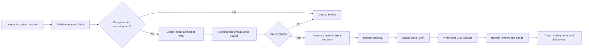

# Mortgage Operations Automation Demo

A human-reviewed workflow that organizes title and insurance orders, selects lender clauses, prepares outbound email drafts, and surfaces missing items and overdue follow-ups.

This repository is a sanitized portfolio demonstration. It contains fictional records only and is not connected to a live mortgage operation.

## Business problem

Mortgage operations teams repeatedly collect loan details, locate the appropriate lender clause, order title or insurance documentation, track missing items, and follow up with vendors. Manual handling increases the risk of missed deadlines, duplicate requests, incomplete messages, and inconsistent tracking.

## Demonstrated solution

- Airtable operational tracker
- Lender-clause lookup for title and insurance requests
- Test and production separation
- Human approval before outbound communication
- Gmail draft creation through Zapier
- Duplicate-draft prevention
- Missing-item, priority, follow-up, and vendor-ETA views
- Daily follow-up digest
- Manual-review state for incomplete or conflicting information

## Workflow

## Human controls

- Messages are drafted, not automatically sent.
- The recipient and populated loan data must be reviewed before sending.
- Missing clauses route to manual review.
- Consequential loan decisions are outside the system.
- The workflow does not approve, deny, underwrite, or determine loan eligibility.

## Repository contents

- [`docs/architecture.md`](docs/architecture.md): components and data flow
- [`docs/case-study.md`](docs/case-study.md): portfolio case study
- [`docs/security-and-privacy.md`](docs/security-and-privacy.md): safeguards and limitations
- [`docs/testing.md`](docs/testing.md): verified test scenarios
- [`docs/user-guide.md`](docs/user-guide.md): simplified operating instructions
- [`examples/fictional-orders.csv`](examples/fictional-orders.csv): synthetic demonstration data
- [`examples/title-request-template.md`](examples/title-request-template.md): title request template
- [`examples/insurance-request-template.md`](examples/insurance-request-template.md): insurance request template

## Technology

- Airtable
- Zapier
- Gmail
- AI-assisted structured data extraction

The portfolio focuses on the operational design and control logic rather than exposing live credentials, proprietary client configuration, or borrower information.

## Status

The sanitized demonstration reflects tested title and insurance clause selection, template generation, draft creation, writeback, duplicate protection, operational views, and scheduled digest delivery. A real deployment still requires client-specific configuration, permissions, testing, training, and compliance review.

